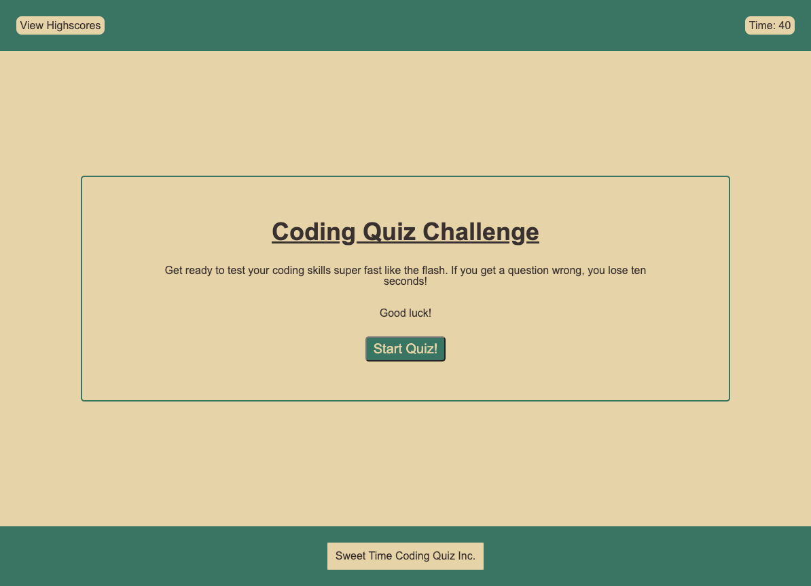
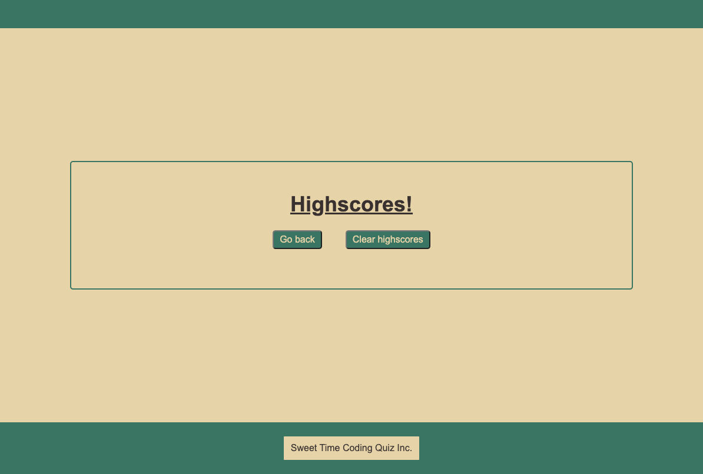

# Coding Quiz

## Description

This is a coding quiz I built to practice my skills with JavaScript and Web APIs. It allowed me to practice building a page from scratch utilizing basic HTML and CSS, but mostly relying on leveraging Web APIs for dynamic interactivity and formatting. This was my first major experience in using Web APIs to this extent, and I also gained more practice in logical thinking and effective ways of organizing my code. This also servced as a great platform to try and continue developing my UI mind to design pleasant to look at webpages – though, as focus was primarily on JavaScript and Web APIs, I limited my CSS scope to focus on general positioning and display and only worked to beautify particular elements.

## Installation

No installation necessary.

## Usage

Just visit the page here [here](https://coldweatherboyy.github.io/Code-Quiz/), click the Start Quiz button, and enjoy!

Additional questions can be added in a fairly straightforward fashion as desired. Recommended to update total timer time if so.

You can view the two pages below: 

## Credits

Second eyes, debugging help, and moral support from [Antal Spector-Zabusky](https://gitlab.com/antalsz).